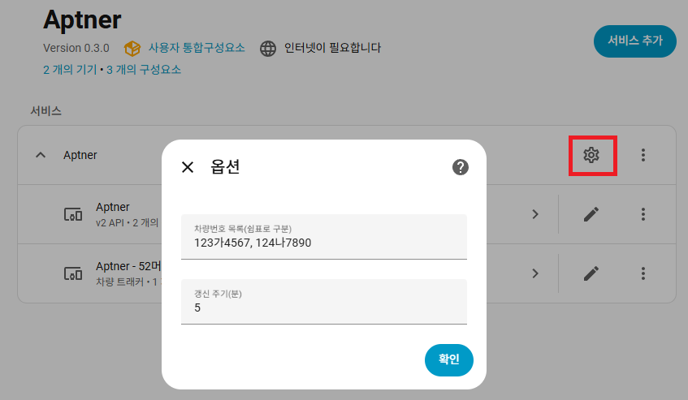
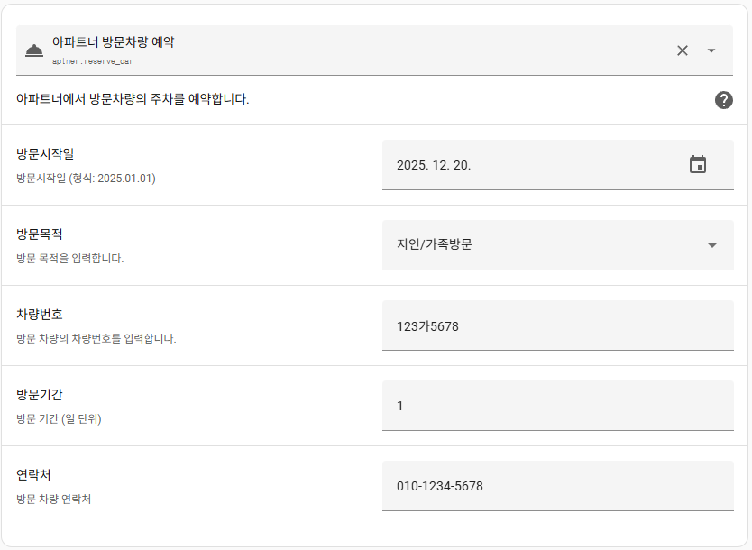
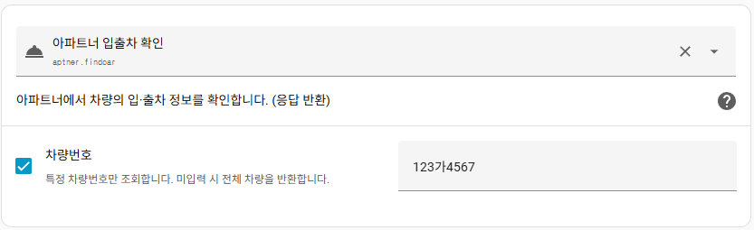
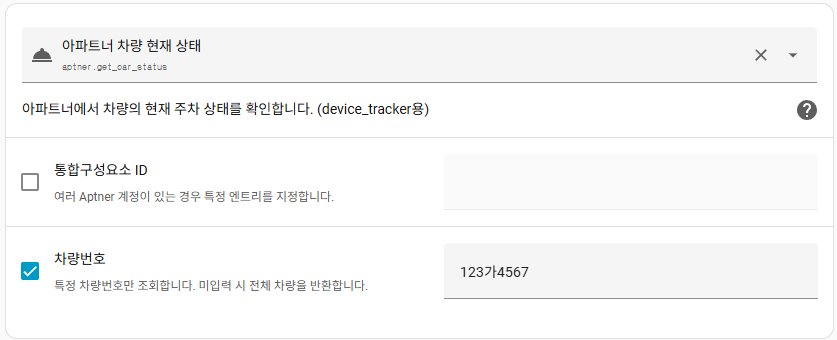
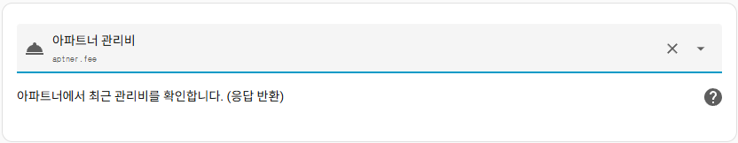

# Aptner Home Assistant Custom Component

**Aptner(아파트너) v2 API**를 사용하는 Home Assistant 커스텀 통합입니다.  
아파트 주차 관련 정보를 Home Assistant에서 **센서·디바이스 트래커·서비스** 형태로 확인하고 일부 기능을 제어할 수 있습니다.

---

## 주요 기능

### 센서(Sensor)
- **관리비 센서**
  - 최근 청구된 관리비(KRW) 표시
  - 연/월 정보 및 상세 요금 내역 제공
- **예약 현황 센서**
  - 향후 예약이 있는 차량 수 표시
  - 차량별 예약 기간(from ~ to) 정보 제공

### 디바이스 트래커(Device Tracker)
- **차량 주차 상태 추적**
  - 등록한 차량 번호 기준으로 상태 생성
  - `home` : 현재 주차 중(입차 상태)
  - `not_home` : 외출 중(출차 상태)
- 추가 속성:
  - 차량 번호
  - 상태(`in`, `out`)
  - 입차/출차 일시

### 서비스(Service)
- `aptner.fee`  
  → 주차 요금 상세 조회
- `aptner.findcar`  
  → 차량 입·출차 기록 조회
- `aptner.get_car_status`  
  → 현재 차량 주차 상태 조회
- `aptner.get_reserve_status`  
  → 차량 예약 현황 조회
- `aptner.reserve_car`  
  → 차량 예약 등록

### 설정(Config Flow & 옵션)
- UI 기반 설정 (YAML 불필요)
- 옵션 설정 가능 항목
  - 차량 번호 목록(쉼표로 구분)
  - 갱신 주기(5~1440분)

---

## 설치 방법

### HACS 설치 (권장)

1. **HACS** 열기
2. **통합(Integrations)** 메뉴 이동
3. 우측 상단 **⋮ → 사용자 정의 저장소**
4. 아래 저장소 추가
https://github.com/af950833/aptner
5. 카테고리: **Integration**
6. **Aptner** 설치
7. Home Assistant 재시작

---

## 설정 방법

1. **설정 → 기기 및 서비스**
2. **통합 추가**
3. **Aptner** 검색
4. 아파트너 계정 정보 입력
- 아이디
- 비밀번호

### 옵션 설정 (설정 후 device_tracker 로 생성됨)
- **차량 번호**
12가3456, 34나7890
- **갱신 주기**
- 최소: 5분
- 최대: 1440분

---

## 생성되는 엔티티

### 센서
| 엔티티 | 설명 |
|------|------|
| `sensor.aptner_fee` | 최근 관리비 |
| `sensor.aptner_reserve` | 향후 예약 차량 수 |

### 디바이스 트래커
| 엔티티 | 설명 |
|------|------|
| `device_tracker.aptner_차량번호` | 차량 주차 상태(Home/Not_home) |

---

## 서비스 사용 예시

### 차량 예약

### 차량 예약 확인

### 입출차 확인

### 차량 상태 확인

### 관리비 확인

### Version History
25/12/19 1.0.0 Initial Release

